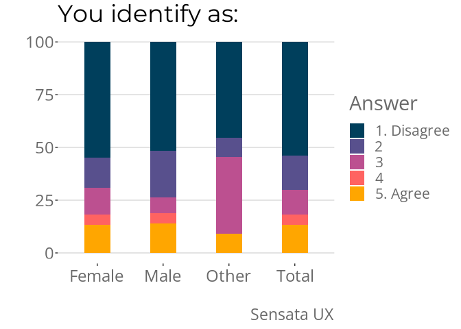

Intro a R y SensataDataAnalysis
================
Gabriel N. Camargo-Toledo
04/08/2022

# Introducción a sensata Data Framework

Este documento presenta una guía de los paquetes de R utilizados para
preparar, limpiar y analizar los datos de encuestas recolectados con la
plataforma Sensata. Para eso tenemos una serie de paquetes que preparan
los datos y ayudan a hacer más sencillo y uniforme los análisis.

Después de que recolectamos las encuestas en nuestra plataforma, los
datos quedan cargados en un servidor (mongoDB). Estos datos quedan un
formato poco amigable para el análisis, es un archivo con muchas
columnas:

``` r
rawMetaDataExample
```

    ## # A tibble: 6 × 19
    ##   `_id`      createdAt           surve…¹ surve…² param…³ param…⁴ param…⁵ param…⁶
    ##   <chr>      <dttm>              <chr>   <chr>   <chr>   <chr>   <chr>   <lgl>  
    ## 1 ObjectId(… 2021-09-13 03:47:48 11QdjX… [BPO] … fb      cpc     live    TRUE   
    ## 2 ObjectId(… 2021-09-13 04:15:02 11QdjX… [BPO] … fb      cpc     live    NA     
    ## 3 ObjectId(… 2021-09-17 20:52:26 11QdjX… [BPO] … fb      cpc     live    NA     
    ## 4 ObjectId(… 2021-09-17 20:54:09 11QdjX… [BPO] … fb      cpc     live    NA     
    ## 5 ObjectId(… 2021-09-17 21:06:31 11QdjX… [BPO] … fb      cpc     live    NA     
    ## 6 ObjectId(… 2021-09-17 21:33:29 11QdjX… [BPO] … fb      cpc     live    NA     
    ## # … with 11 more variables: params.testing <lgl>, totalTimeMin <dbl>,
    ## #   fingerprint <chr>, sensataId <chr>, geolocation.coordinates <chr>,
    ## #   lat <dbl>, long <dbl>, browserReport.ip <chr>, browserReport.os.name <chr>,
    ## #   browserReport.browser.name <chr>, trialUser.userId <lgl>, and abbreviated
    ## #   variable names ¹​surveyId, ²​surveyName, ³​params.utm_source,
    ## #   ⁴​params.utm_medium, ⁵​params.utm_campaign, ⁶​params.test
    ## # ℹ Use `colnames()` to see all variable names

``` r
rawQ0DataExample
```

    ## # A tibble: 6 × 14
    ##   newResponses…¹ newRe…² newRe…³ newRe…⁴ newRe…⁵ newRe…⁶ newRe…⁷ newRe…⁸ newRe…⁹
    ##   <chr>          <chr>     <dbl> <chr>     <dbl> <chr>   <chr>     <dbl>   <dbl>
    ## 1 q_AB_SC_00     4ov5DS…       0 screen      196 "How c… next     216936       1
    ## 2 q_AB_SC_00     4ov5DS…       0 screen      196 "How c… next       2480       1
    ## 3 q_AB_SC_00     4ov5DS…       0 screen      224 "¿Cúal… next      14370       1
    ## 4 q_AB_SC_00     4ov5DS…       0 screen      224 "¿Cúal… next       2857       1
    ## 5 q_AB_SC_00     4ov5DS…       0 screen      224 "¿Cúal… next       4877       1
    ## 6 q_AB_SC_00     4ov5DS…       0 screen      224 "¿Cúal… next       6520       1
    ## # … with 5 more variables: newResponses.q0.isSorting <lgl>,
    ## #   newResponses.q0.isOrdered <lgl>, newResponses.q0.altOption <lgl>,
    ## #   newResponses.q0.options <chr>, newResponses.q0.numberOfOptions <dbl>, and
    ## #   abbreviated variable names ¹​newResponses.q0.identifier,
    ## #   ²​newResponses.q0.contentfulId, ³​newResponses.q0.qid, ⁴​newResponses.q0.type,
    ## #   ⁵​newResponses.q0.questionLength, ⁶​newResponses.q0.question,
    ## #   ⁷​newResponses.q0.selected, ⁸​newResponses.q0.timeToCompletion, …
    ## # ℹ Use `colnames()` to see all variable names

Normalmente el equipo de data utiliza el paquete *sensataDataProg* para
dejar los datos como los queremos, una fila por individuo y cada columna
es una pregunta:

``` r
sensataExAnalysis
```

    ## # A tibble: 2,831 × 86
    ##    id    geolo…¹ q_EA_…² q_EA_…³ q_EA_…⁴ q_EA_…⁵ q_EA_…⁶ q_EA_…⁷ q_EA_…⁸ q_EA_…⁹
    ##    <chr> <chr>   <fct>   <chr>   <fct>   <fct>   <fct>   <fct>   <fct>   <fct>  
    ##  1 6101… [-73.9… <NA>    Colomb… 1-2 ti… 2-3 ti… 1-2 ti… 1-2 ti… Never   Both o…
    ##  2 6101… [-74.7… <NA>    Colomb… Never   2-3 ti… 1-2 ti… Never   Never   Both o…
    ##  3 6101… [-74.1… <NA>    Colomb… 1-2 ti… Every … Never   Never   Never   Both o…
    ##  4 6101… [-76.5… <NA>    Colomb… Never   2-3 ti… Never   Never   Never   Both o…
    ##  5 6101… [-75.5… <NA>    Colomb… Never   Every … Never   Never   Never   Both o…
    ##  6 6101… [-74.1… <NA>    Colomb… 2-3 ti… Every … Every … 1-2 ti… 1-2 ti… Both o…
    ##  7 6101… [-74.5… <NA>    Colomb… Never   Every … Never   1-2 ti… Never   Both o…
    ##  8 6101… [-76.4… <NA>    Colomb… Never   2-3 ti… Never   1-2 ti… Never   Both o…
    ##  9 6101… [-75.5… <NA>    Colomb… 1-2 ti… Every … Never   Never   1-2 ti… Sugar …
    ## 10 6101… [-74.0… <NA>    Colomb… 1-2 ti… 2-3 ti… Never   Never   Never   Both o…
    ## # … with 2,821 more rows, 76 more variables: q_EA_CU_01 <fct>,
    ## #   q_EA_CU_02 <fct>, q_EA_JS_01 <fct>, q_EA_IN_01 <fct>, q_EA_CU_04 <fct>,
    ## #   q_EA_CU_05 <fct>, q_EA_CU_06 <ord>, q_EA_IN_02 <ord>, q_EA_IN_08 <ord>,
    ## #   q_EA_IN_03 <ord>, q_EA_IN_04 <ord>, q_EA_JS_02 <ord>, q_EA_IN_05 <ord>,
    ## #   q_EA_JS_03 <ord>, q_EA_IN_07 <fct>, q_EA_MO_07 <fct>, q_EA_MO_08 <fct>,
    ## #   q_EA_MO_09 <fct>, q_EA_IN_06 <fct>, q_EA_JS_04 <fct>, q_EA_JS_05 <fct>,
    ## #   q_EA_JS_06 <fct>, q_EA_MO_11 <ord>, q_EA_CU_07 <ord>, q_EA_IS_01 <fct>, …
    ## # ℹ Use `print(n = ...)` to see more rows, and `colnames()` to see all variable names

R nos permite limpiar los datos como queremos, además de crear gráficos
cómo nos gustan. Tiene la ventaja de que es freeware, gratis y
totalmente customizable para nuestras necesidades. Tenemos dos paquetes
que hacen que los procesos que debemos crear siempre sean más sencillos:
*sensataDataProg* y *sensataDataAnalysis*. El paquete *sensataDataProg*
está ya en versión 1.0.0, es decir es completo. Por el contrario,
*sensataDataAnalysis* aún necesita trabajo.

En esta guía vamos a hablar solo de *sensataDataAnalysis*, que es el
necesario para crear gráficas.

## Qué es R y Rstudio

“R es un lenguaje y ambiente de programación para computación
estadística y gráficas.” Es flexible y altamente extensible, por lo que
permite crear “paquetes” para muchas cosas. En sensata usamos el grupo
de paquetes [tidyverse](https://www.tidyverse.org). Los paquetes añaden
funcionalidad adicional a R, y el tidyverse en especial está pensando en
hacer la mayoría de las cosas de una manera más consistente y con un
lenguaje más sencillo. Pueden aprender más con este
[libro](https://r4ds.had.co.nz/).

Rstudio es una interfaz gráfica de desarrollo que hace que usar el
lenguaje R sea más fácil y amigable. Revisemos cómo funciona Rstudio
acá.

(Trucos para ver el historial, para ver el ambiente, ver las gráficas,
etc)

## Primer paso, paquete, cargar fuentes y decisiones estéticas

Al abrir Rstudio (o R) se carga solo la funcionalidad básica. Para
utilizar las funciones sensata necesitamos instalar y cargar el paquete
*sensataDataAnalysis*. Para instalar el paquete de github hay que
instalar antes otro paquete, *devtools* y suele evitar problemas si
instalamos antes el *tidyverse*:

``` r
install.packages("devtools")
install.packages("tidyverse")
devtools::install_github(repo = "https://github.com/SensataUx/sensataDataAnalysis", ref = "main")
```

Instalar el paquete no implica que esté disponible para usar su
funcionalidad. Por eso en el chunk anterior, después de instalar usé
`devtools::install_github()`, accede al paquete *devtools* y utiliza la
función *install_github()*. Pero a veces vamos a usar muchas veces
distintas funciones de un paquete, para esto es necesario cargarlo. Esto
se hace así:

``` r
library(sensataDataAnalysis)
```

Después de esto ya podemos cargar las fuentes y decisiones estéticas que
vamos a usar:

``` r
#Cargar fuentes

font_add_google(name = "Open Sans", family = "Open Sans")
font_add_google(name = "News Cycle", family = "News Cycle")
font_add_google(name = "Montserrat", family = "montserrat")
showtext_auto()

# Paleta de colores OJO el orden importa
movPaleta5 <- c("#003f5c",
               "#58508d",
               "#bc5090",
               "#ff6361",
               "#ffa600")

# Decisiones sobre estética de las gráficas
theme_sensata <-   theme(text = element_text(family = "Open Sans", size = 22),
                         axis.title = element_text(colour = "dimgray", size = 20),
                         axis.text.x = element_text(angle = 0,
                                                    vjust = 0.5,
                                                    hjust = 0.5,
                                                    size = 18,
                                                    colour = "dimgray"),
                         axis.text.y = element_text(size = 18,
                                                    colour = "dimgray"),
                         legend.text = element_text(size = 16,
                                                    colour = "dimgray"),
                         legend.title = element_text(colour = "dimgray"),
                         plot.title = element_text(family = "Montserrat", 
                                                   colour = "black",
                                                   size = 26, 
                                                   lineheight=.5),
                         plot.caption = element_text(colour = "dimgray"),
                         plot.subtitle = element_text(family = "Montserrat",
                                                      size = 18),
                         panel.background = element_rect(size = 0, fill = "white"),
                         panel.grid.major = element_line(size = 0.5, linetype = 'solid',
                                                         colour = "gray85"),
                         panel.grid.major.x = element_blank(),
                         legend.key=element_rect(fill = "white", colour = "white"))
```

## Primer paso, cargar datos

Por ahora vamos a usar unos datos de ejemplo que vienen en el paquete
*sensataDataAnalysis*, después aprendemos cómo cargar datos que tenemos
en nuestra computadora.

``` r
sensataExAnalysis <- sensataDataAnalysis::sensataExAnalysis
```

Fijense en los nombres de los objetos que voy creando.

## Segundo paso, preparar datos para gráfica

Los microdatos no son lo que necesitamos para hacer una gráfica, es por
eso que el paquete *sensataDataAnalysis* tiene una función que
simplifica la manipulación de los datos a algo que podamos usar en
ggplot. ggplot es el sistema de gráficas de tidyverse del cuál vamos a
ir aprendiendo hoy.

``` r
graphData <- createGraphData(df = sensataExAnalysis, originVar = "q_EA_IN_03", groupVar = "q_EA_CA_10")
graphData
```

    ## # A tibble: 20 × 3
    ## # Groups:   q_EA_CA_10 [4]
    ##    q_EA_CA_10 Porcentaje Value      
    ##    <chr>           <dbl> <ord>      
    ##  1 Female          54.7  1. Disagree
    ##  2 Female          14.5  2          
    ##  3 Female          12.8  3          
    ##  4 Female           4.79 4          
    ##  5 Female          13.3  5. Agree   
    ##  6 Male            51.6  1. Disagree
    ##  7 Male            22.2  2          
    ##  8 Male             7.35 3          
    ##  9 Male             4.80 4          
    ## 10 Male            14.1  5. Agree   
    ## 11 Other           45.5  1. Disagree
    ## 12 Other            9.09 2          
    ## 13 Other           36.4  3          
    ## 14 Other            0    4          
    ## 15 Other            9.09 5. Agree   
    ## 16 Total           54.0  1. Disagree
    ## 17 Total           16.2  2          
    ## 18 Total           11.7  3          
    ## 19 Total            4.77 4          
    ## 20 Total           13.4  5. Agree

## Tercer paso, crear la gráfica

Para crear la gráfica vamos a usar ggplot

``` r
p <- ggplot(graphData, aes(x=q_EA_CA_10, y=Porcentaje)) 
g <- geom_col(aes(fill=Value),  width = 0.4)

p + g + labs(title = var_label(sensataExAnalysis$q_EA_CA_10),
             # subtitle = "Total",
             caption = "Sensata UX",
             fill = "Answer") + 
  xlab("") + ylab("") +
  theme_sensata +
  scale_fill_manual(values = movPaleta5)
```

<!-- -->

``` r
# ggsave(filename = "figures/q_MV_JG_26_Tot_PMC.png", device = "png", height = 7, width = 14, units = "cm")
```
